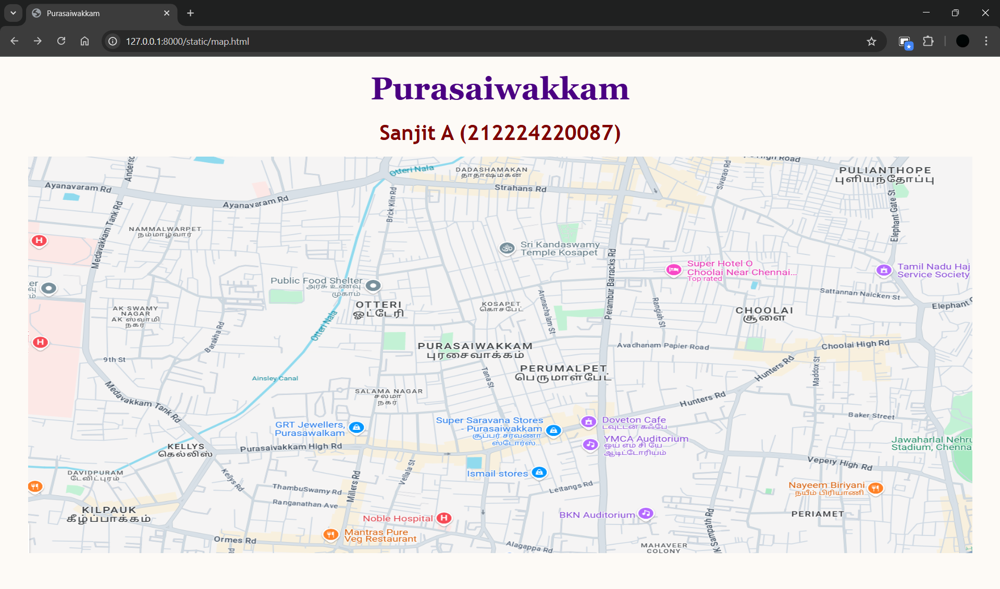

# Ex04 Places Around Me
## Date: 19/04/25 
## Name: Sanjit A , Register no: 212224220087

## AIM
To develop a website to display details about the places around my house.

## DESIGN STEPS

### STEP 1
Create a Django admin interface.

### STEP 2
Download your city map from Google.

### STEP 3
Using ```<map>``` tag name the map.

### STEP 4
Create clickable regions in the image using ```<area>``` tag.

### STEP 5
Write HTML programs for all the regions identified.

### STEP 6
Execute the programs and publish them.

## CODE

```
map.html:

<!DOCTYPE html>
<html>
<head>
    <title>Purasaiwakkam</title>
</head>
<body bgcolor="#fdfaf6" text="#2c2c2c">

    <h1 align="center">
        <font color="#4B0082" size="10" face="Georgia">Purasaiwakkam</font>
    </h1>

    <h3 align="center">
        <font color="#800000" size="6" face="Trebuchet MS">Sanjit A (212224220087)</font>
    </h3>

    <center>
        
        <map name="Purasaiwakkam">
            <area target="" alt="Saravana Stores" title="Saravana Stores" href="saravana.html" coords="542,86,669,164" shape="rect">
            <area target="" alt="GRT Jewellers" title="GRT Jewellers" href="grt.html" coords="648,285,771,351" shape="rect">
            <area target="" alt="Doveton Cafe" title="Doveton Cafe" href="doveton.html" coords="1085,215,1297,291" shape="rect">
            <area target="" alt="Noble hospital" title="Noble hospital" href="noble.html" coords="476,345,643,407" shape="rect">
            <area target="" alt="YMCA Auditorium" title="YMCA Auditorium" href="ymca.html" coords="306,530,490,556" shape="rect">
        </map>
    </center>

</body>
</html>

saravana.html:

<!DOCTYPE html>
<html>
<head>
    <title>Purasaiwakkam</title>
</head>
<body bgcolor="#fefcf9" text="#2c2c2c">

    <h1 align="center">
        <font size="10">Purasaiwakkam</font>
    </h1>

    <h2 align="center">
        <font size="7">Saravana Stores</font>
    </h2>

    <hr size="5" width="80%" color="#003366">

    <p align="center">
        <font face="Georgia" size="6">
            Saravana Stores' Purasawalkam branch in Chennai holds a significant place in the retail chain's history. 
            Established in 2010, it was the company's second showroom, marking its expansion beyond the original T. Nagar location. ​
            The store is situated at 10, Purasawalkam High Road, Purasaiwakkam, Chennai, Tamil Nadu 600007. 
            It operates daily from 9:00 AM to 10:00 PM, offering a wide range of products including textiles, jewellery, electronics, and household items. 
        </font>
    </p>

    <hr size="3" width="60%" color="#800020">

</body>
</html>

grt.html:

<!DOCTYPE html>
<html>
<head>
    <title>Purasaiwakkam</title>
</head>
<body bgcolor="#fefcf9" text="#2c2c2c">

    <h1 align="center">
        <font size="10">Purasaiwakkam</font>
    </h1>

    <h2 align="center">
        <font size="7">GRT Jewellers</font>
    </h2>

    <hr size="5" width="80%" color="#003366">

    <p align="center">
        <font face="Georgia" size="6">
            GRT Jewellers, also known as G.R. Thanga Maaligai, is a renowned jewellery brand based in Chennai, India. 
            Founded in 1964 by G. Rajendran in T. Nagar, Chennai, the company has expanded significantly over the years, establishing over 60 showrooms across India and internationally .​
            The Purasawalkam branch of GRT Jewellers opened in 2010, marking a significant expansion of the brand within Chennai . 
            Located at 226, Purasawalkam High Road, near Abirami Mega Mall, this showroom offers a wide range of jewellery collections, including gold, silver, diamond, and platinum pieces .​
        </font>
    </p>

    <hr size="3" width="60%" color="#800020">

</body>
</html>


noble.html:

<!DOCTYPE html>
<html>
<head>
    <title>Purasaiwakkam</title>
</head>
<body bgcolor="#fefcf9" text="#2c2c2c">

    <h1 align="center">
        <font size="10">Purasaiwakkam</font>
    </h1>

    <h2 align="center">
        <font size="7">Noble hospital</font>
    </h2>

    <hr size="5" width="80%" color="#003366">

    <p align="center">
        <font face="Georgia" size="6">
            Noble Hospital, situated at 4, Audiappa Mudali Street, Purasawalkam, Chennai, is a multi-specialty healthcare facility established in 2008. 
            With a capacity of 104 beds, including 15 ICU beds, the hospital offers a wide range of medical services across various specialties such as 
            gastroenterology, urology, general surgery, ENT, oncology, nephrology, pulmonology, pediatrics, dermatology, and endocrinology 
        </font>
    </p>

    <hr size="3" width="60%" color="#800020">

</body>
</html>

ymca.html:

<!DOCTYPE html>
<html>
<head>
    <title>Purasaiwakkam</title>
</head>
<body bgcolor="#fefcf9" text="#2c2c2c">

    <h1 align="center">
        <font size="10">Purasaiwakkam</font>
    </h1>

    <h2 align="center">
        <font size="7">YMCA Auditorium</font>
    </h2>

    <hr size="5" width="80%" color="#003366">

    <p align="center">
        <font face="Georgia" size="6">
            The YMCA Vepery Auditorium, located at 6/74 Ritherdon Road, Vepery, Purasawalkam, Chennai, is a historic venue with a legacy spanning over six decades. 
            Established in the early 1960s, it has become a prominent landmark in Chennai, hosting a variety of events including weddings, receptions, and corporate functions. 
            The auditorium encompasses 13,000 square feet of built-up area on 15 grounds of land, featuring four rentable areas and eight upgraded suites .
        </font>
    </p>

    <hr size="3" width="60%" color="#800020">

</body>
</html>
```

## OUTPUT:


## RESULT
The program for implementing image maps using HTML is executed successfully.
